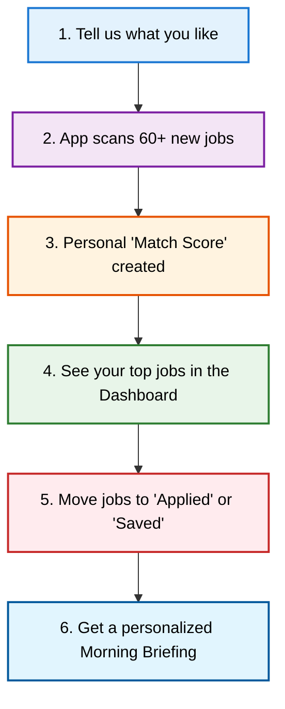
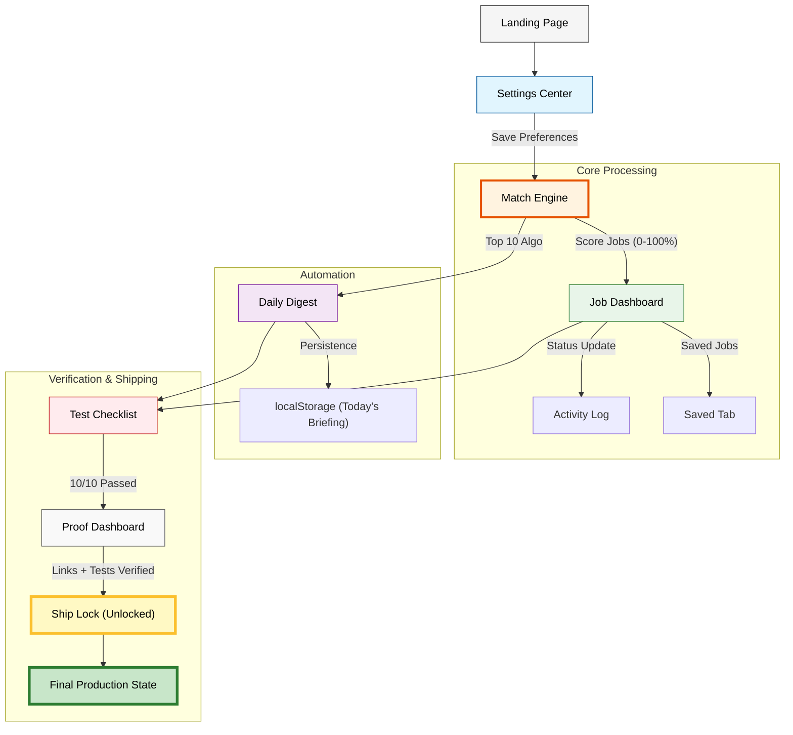

# How the Job Notification Tracker Works

## Simple Version (User Journey)

**What it does for you:**
- **Saves Time**: No more searching for hours.
- **Smart Picks**: Only shows jobs that actually fit your skills.
- **Organization**: Keeps all your applications in one clean place.

---

## Technical Version (System Architecture)

